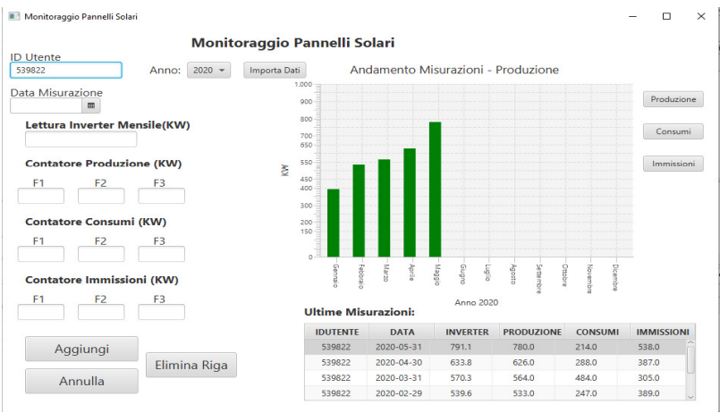

# MonitoraggioPannelliSolari

MonitoraggioPannelliSolari is a simple java application in which is possible to keeping track about the electrical consumption, production and immision of a solar panels system of a private house.

Following there are some screenshot about the GUI:

  
   
  

